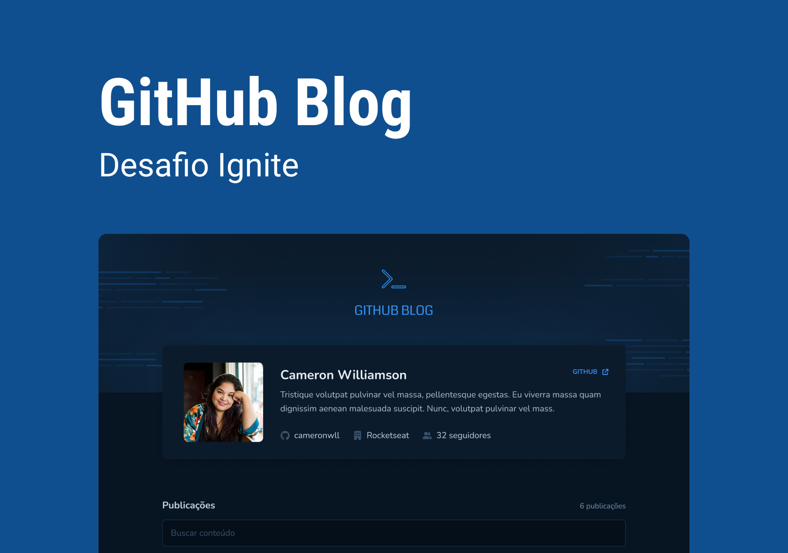

<h1 align="center">GitHub Blog</h1>

    Projeto pratico de treinamento by Ignite 💚

    <a href="#-tecnologias">Tecnologias</a>&nbsp;&nbsp;&nbsp;|&nbsp;&nbsp;&nbsp;
    <a href="#-projeto">Projeto</a>&nbsp;&nbsp;&nbsp;|&nbsp;&nbsp;&nbsp;
    <a href="#-layout">Layout</a>

 

    

## 🚀 Tecnologias

Esse projeto foi desenvolvido com as seguintes tecnologias:

- Vite
- TypeScript
- ReactJS
- Hooks (Use State, Use Effect, Use Callback, Use Memo, Use Params)
- React Hook Form
- React Router DOM
- React Markdown
- Date fns
- Styled Components
- Zod
- Axios

## 💻 Projeto

O GitHub Blog é um projeto simples porem desafiador que coloca em prova a habilidade de buscar dados dentro de uma API.  
Nesse projeto foi utilizado a API do GitHub para ter acesso ao dados do perfil e as issues dentro de um repositório, nesse caso utilizei do meu próprio perfil e repositório.  

O projeto possui um sistema de busca onde é possível filtrar palavras especificas dentro das issues criadas retornando apenas o post que conter a palavra pesquisada.  

Também é possível visualizar o post completo em uma rota da própria aplicação ou visualizar a publicação original no GitHub.

## 📋 Layout 

Voce pode visualizar o layout do projeto através [DESSE LINK](https://www.figma.com/file/ZlFfXBICRUw0BuS6F9jNge/GitHub-Blog). É necessário ter uma conta no [Figma](https://figma.com) para acessa-lo.

---

Feito com 💜 by Phelipe Pereira :wave:
